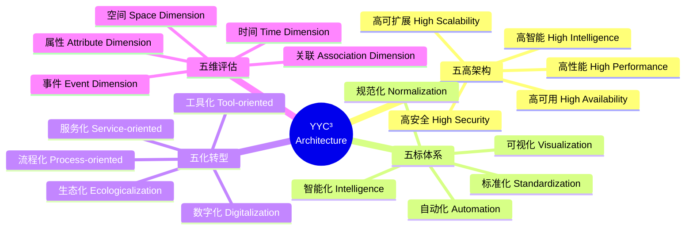
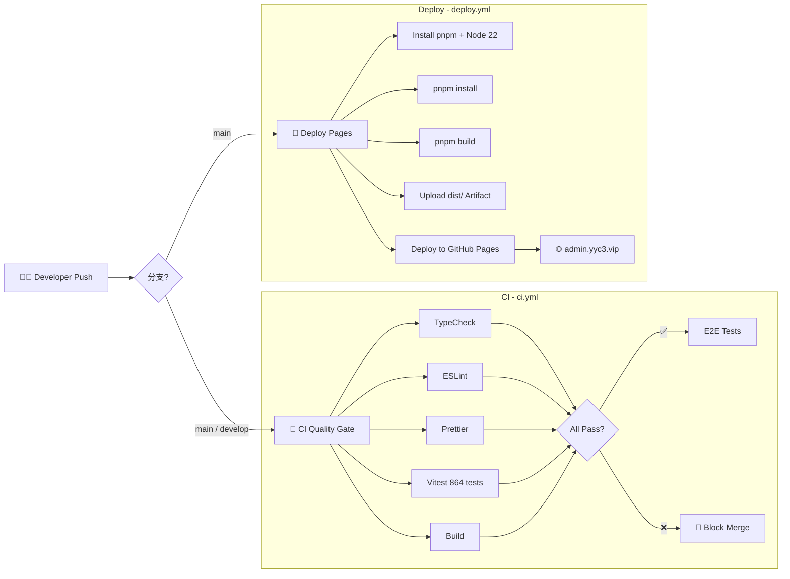
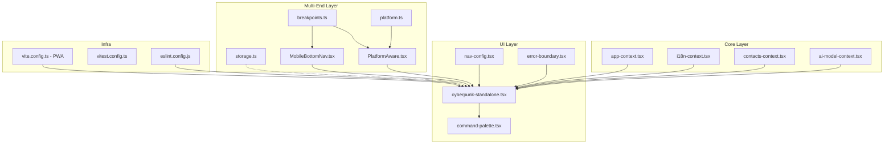

<div align="center">
  <picture>
    <source media="(prefers-color-scheme: dark)" srcset="./public/Family-001.png">
    
  </picture>
</div>

<div align="center">

# 🧊 YYC³ Administration

**AI Marketing Automation Terminal · 企业级智能营销管理平台**

**言启千行代码 · 语枢万物智能**
_Words Inspire Thousands Lines of Code, Language Pivots the Intelligence of All Things_

[](https://admin.yyc3.vip)
[](https://admin.yyc3.vip)
[](https://github.com/YYC-Cube/YYC3-Administration/releases)
[](./LICENSE)

[](https://react.dev)
[](https://www.typescriptlang.org)
[](https://vitejs.dev)
[](https://tailwindcss.com)
[](https://pnpm.io)
[](https://zustand-demo.pmnd.rs)
[](https://ui.shadcn.com)
[](https://www.radix-ui.com)
[](https://motion.dev)
[](https://vitest.dev)
[](https://playwright.dev)
[](https://www.docker.com)
[](https://developer.mozilla.org/en-US/docs/Web/Progressive_web_apps)

[](https://github.com/YYC-Cube/YYC3-Administration/actions/workflows/ci.yml)
[](https://github.com/YYC-Cube/YYC3-Administration/actions/workflows/deploy.yml)
[](https://eslint.org)
[](https://prettier.io)
[](https://www.typescriptlang.org)
[](https://github.com/YYC-Cube/YYC3-Administration/actions/workflows/ci.yml)
[](./docs/YYC3-M13-MultiEnd-多端适配/)
[](./CONTRIBUTING.md)
[](https://github.com/YYC-Cube/YYC3-Administration)

—— **五高架构** · **五标体系** · **五化转型** · **五维评估** ——

_High Availability · High Performance · High Security · High Scalability · High Intelligence_

</div>

---

## 📋 Table of Contents · 目录

- [🧊 YYC³ Administration](#-yyc-administration)
  - [📋 Table of Contents · 目录](#-table-of-contents--目录)
  - [🇨🇳 中文文档](#-中文文档)
    - [✨ 项目概述](#-项目概述)
      - [核心特性](#核心特性)
    - [🧬 架构设计](#-架构设计)
      - [五维架构理念](#五维架构理念)
      - [Provider 层级架构](#provider-层级架构)
      - [单元自治原则](#单元自治原则)
      - [CI/CD 流程](#cicd-流程)
      - [模块依赖关系](#模块依赖关系)
    - [🛠️ 技术栈](#️-技术栈)
    - [🚀 快速开始](#-快速开始)
      - [前置要求](#前置要求)
      - [安装与启动](#安装与启动)
      - [常用命令速查](#常用命令速查)
    - [🔐 环境变量](#-环境变量)
    - [📁 项目结构](#-项目结构)
    - [🎯 功能模块](#-功能模块)
      - [模块全景](#模块全景)
    - [🎨 主题系统](#-主题系统)
    - [📱 多端适配](#-多端适配)
      - [端覆盖矩阵](#端覆盖矩阵)
      - [响应式断点系统](#响应式断点系统)
      - [核心模块](#核心模块)
      - [PWA 配置](#pwa-配置)
    - [🌍 国际化](#-国际化)
    - [📊 性能指标](#-性能指标)
    - [🔐 安全](#-安全)
    - [🧪 测试](#-测试)
    - [🚀 部署](#-部署)
      - [GitHub Pages（当前）](#github-pages当前)
      - [Docker](#docker)
      - [Docker Compose](#docker-compose)
      - [静态部署](#静态部署)
    - [📝 更新日志](#-更新日志)
    - [🤝 贡献指南](#-贡献指南)
  - [🇬🇧 English](#-english)
    - [✨ Project Overview](#-project-overview)
      - [Core Features](#core-features)
    - [🧬 Architecture](#-architecture)
      - [Provider Hierarchy](#provider-hierarchy)
      - [Unit Autonomy Principle](#unit-autonomy-principle)
    - [🛠️ Tech Stack](#️-tech-stack)
    - [🚀 Quick Start](#-quick-start)
      - [Quick Commands](#quick-commands)
    - [🔐 Environment Variables](#-environment-variables)
    - [📁 Project Structure](#-project-structure)
    - [🎯 Feature Modules](#-feature-modules)
    - [🎨 Theme System](#-theme-system)
    - [📱 Multi-End Adaptation](#-multi-end-adaptation)
    - [🌍 Internationalization](#-internationalization)
    - [📊 Performance](#-performance)
    - [🔐 Security](#-security)
    - [🧪 Testing](#-testing)
    - [🚀 Deployment](#-deployment)
      - [GitHub Pages (Current)](#github-pages-current)
      - [Docker](#docker-1)
      - [Docker Compose](#docker-compose-1)
      - [Static Hosting](#static-hosting)
    - [📝 Changelog](#-changelog)
    - [🤝 Contributing](#-contributing)
  - [📄 License](#-license)

---

## 🇨🇳 中文文档

### ✨ 项目概述

**YYC³ Administration**（曾用名：YYC³ My-Mgmt）是一款基于 **React 18 + TypeScript + Vite 6** 构建的现代化 **AI 营销自动化终端系统**，专为服务行业设计的 **企业级全维度管理平台**。

平台遵循 **「五高五标五化」** 架构理念（五高架构 · 五标体系 · 五化转型 · 五维评估），集成多模型 AI 能力、双主题引擎、全维度数据驾驶舱和开发者工作区，实现了从客户获取到忠诚管理的全生命周期闭环。

#### 核心特性

| 特性                          | 描述                                                                           |
| :---------------------------- | :----------------------------------------------------------------------------- |
| 🤖 **多模型 AI 集成**         | OpenAI / Claude / DeepSeek / Qwen 多模型切换，流式响应，智能体编排             |
| 🎨 **双主题引擎**             | Cyberpunk 霓虹风格 + Liquid Glass 液态玻璃，支持实时切换与深度定制             |
| 📊 **全维度数据驾驶舱**       | 实时 KPI 监控、趋势分析、多维度可视化，支持 10+ 图表类型                       |
| 💬 **客户生命周期管理 (CLM)** | 五阶段闭环：获客 → 转化 → 成交 → 服务 → 忠诚                                   |
| 🧑‍🤝‍🧑 **客户关怀系统**           | 智能通知引擎、自动化关怀任务、全渠道触达                                       |
| 📝 **智能表单系统**           | 可视化构建器、条件逻辑引擎、模板库、跨设备适配                                 |
| 💰 **财务管理**               | 收支追踪、发票管理、预算控制、财务报表                                         |
| 💳 **薪资系统**               | 薪资核算、税务计算、社保管理、工资单生成                                       |
| 🔧 **开发者工作区**           | Monaco 编辑器、Git 集成、6 面板拖拽布局、终端模拟器                            |
| 🌍 **国际化 (i18n)**          | 10 种语言（zh/zh-TW/en/ja/ko/ar/de/es/fr/pt-BR）实时切换，ICU 消息格式，懒加载 |
| ⚡ **高性能架构**             | Zustand 轻量状态管理、虚拟滚动、懒加载、memo 优化                              |
| 📱 **PWA 全端适配**           | 可安装至桌面/移动端，离线支持，全平台 Logo 适配（Android/iOS/macOS/watchOS）   |

---

### 🧬 架构设计

#### 五维架构理念



#### Provider 层级架构

```
ErrorBoundary
 └── ThemeSwitcherProvider       # 双主题引擎（Cyberpunk / Liquid Glass）
      └── I18nProvider            # 国际化上下文
           └── AppProvider        # 应用全局状态
                └── ContactsProvider   # CRM 客户数据
                     └── AIModelProvider    # AI 多模型管理
                          └── LiquidGlassWrapper   # 液态玻璃特效层
                               └── Page Router (Standalone / Widget)
                                    ├── 导航系统（分类标签 + 侧边栏）
                                    ├── 命令面板（Ctrl+K）
                                    └── 50+ 页面组件
```

#### 单元自治原则

每个功能模块遵循 **单元自治（Unit Autonomy）** 设计：

- **独立数据**：模块拥有自己的 Context/Store，不共享内部状态
- **独立逻辑**：模块内聚完整业务逻辑，对外暴露最小接口
- **独立生命周期**：按需加载、独立挂载/卸载、不影响其他模块
- **独立测试**：每个模块可独立测试，不依赖全局环境

#### CI/CD 流程



#### 模块依赖关系



---

### 🛠️ 技术栈

| 类别       | 技术                   | 版本   | 说明                             |
| :--------- | :--------------------- | :----- | :------------------------------- |
| **框架**   | React                  | 18.3.1 | StrictMode + ErrorBoundary 嵌套  |
| **语言**   | TypeScript             | 5.x    | 严格模式，零 `any` 策略          |
| **构建**   | Vite                   | 6.3.5  | SWC 编译、缓存哈希、Manifest     |
| **样式**   | Tailwind CSS v4        | 4.1.12 | @tailwindcss/vite 插件、CSS 变量 |
| **状态**   | Zustand                | 5.0.12 | 轻量全局状态、不可变更新         |
| **UI**     | shadcn/ui + Radix UI   | latest | 无障碍（WCAG）、全键盘导航       |
| **动画**   | Framer Motion (motion) | 12     | 布局动画、手势、过渡             |
| **AI**     | OpenAI / Anthropic SDK | latest | 流式响应、多 Provider 编排       |
| **图表**   | Recharts               | 3.9.2  | 响应式、10+ 图表类型             |
| **编辑器** | Monaco Editor          | latest | 代码编辑、语法高亮、Diff 视图    |
| **测试**   | Vitest + Playwright    | latest | 单元测试 + E2E 测试              |
| **包管理** | pnpm                   | ≥11    | 高性能依赖管理                   |

---

### 🚀 快速开始

#### 前置要求

- **Node.js** ≥ 22.x（pnpm v11 要求 Node ≥22.13）
- **pnpm** ≥ 11.0（`npm install -g pnpm`）
- **Git** 任意版本

#### 安装与启动

```bash
# 1. 克隆仓库
git clone https://github.com/YYC-Cube/YYC3-Administration.git
cd YYC3-Administration

# 2. 安装依赖
pnpm install

# 3. 启动开发服务器
pnpm dev
# → http://localhost:3171

# 4. 构建生产版本
pnpm build

# 5. 预览生产构建
pnpm preview
```

#### 常用命令速查

| 命令             | 说明                |
| :--------------- | :------------------ |
| `pnpm dev`       | 启动开发服务器      |
| `pnpm build`     | 构建生产版本        |
| `pnpm preview`   | 预览构建产物        |
| `pnpm typecheck` | TypeScript 类型检查 |
| `pnpm lint`      | ESLint 代码检查     |
| `pnpm format`    | Prettier 格式化     |
| `pnpm test`      | 运行单元测试        |
| `pnpm test:e2e`  | 运行 E2E 测试       |
| `pnpm clean`     | 清理构建/缓存       |

---

### 🔐 环境变量

复制 `.env.example` 为 `.env` 并根据需要调整：

```bash
cp .env.example .env
```

| 变量名                     | 说明                                 | 默认值                         |
| :------------------------- | :----------------------------------- | :----------------------------- |
| `VITE_APP_TITLE`           | 应用标题                             | YYC³ AI Marketing Terminal     |
| `VITE_AI_API_BASE_URL`     | AI API 地址                          | `http://localhost:3001/api/ai` |
| `VITE_GITHUB_API_BASE_URL` | GitHub API 地址                      | `https://api.github.com`       |
| `VITE_ENABLE_DEV_TOOLS`    | 开发者工具开关                       | `true`                         |
| `VITE_ENABLE_ANALYTICS`    | 分析统计开关                         | `false`                        |
| `VITE_DEFAULT_THEME`       | 默认主题（cyberpunk / liquid-glass） | `cyberpunk`                    |
| `VITE_DEFAULT_LANGUAGE`    | 默认语言（zh-CN / en-US）            | `zh-CN`                        |
| `VITE_CACHE_TTL`           | 缓存时间（ms）                       | `3600000`                      |
| `VITE_RATE_LIMIT_RPS`      | 请求限流（次/秒）                    | `10`                           |

> **安全提示**：不要在 `VITE_` 前缀变量中放置敏感信息（API Key、Token 等），它们会在构建时被嵌入前端代码。生产环境应使用后端代理。

---

### 📁 项目结构

```
src/
├── app/
│   ├── components/          # 130+ 页面和 UI 组件
│   │   ├── ui/              # shadcn/ui 组件库（48 个）
│   │   ├── panels/          # 开发工作台面板（7 个）
│   │   ├── settings/        # 设置面板（10 个）
│   │   ├── services/        # 服务层（AI 代理/Git/同步/多实例）
│   │   ├── advanced/        # 高级功能（代码分析/流水线/监控/编排）
│   │   ├── hooks/           # 自定义 Hooks（8 个）
│   │   ├── figma/           # 设计资产组件
│   │   ├── *.tsx            # 各功能页面组件
│   │   ├── app-context.tsx   # 全局状态管理
│   │   ├── i18n-context.tsx  # 国际化上下文
│   │   ├── auth-context.tsx  # 认证上下文
│   │   ├── contacts-context.tsx # CRM 上下文
│   │   ├── ai-model-context.tsx # AI 模型管理
│   │   ├── nav-config.ts    # 导航配置中心
│   │   ├── error-boundary.tsx # 错误边界
│   │   └── ...
│   └── locales/             # 应用层国际化（zh/en）
├── lib/i18n/                # i18n 核心引擎
│   ├── registry.ts          # 注册表 + 懒加载
│   ├── formatter.ts         # ICU 消息格式化
│   ├── detector.ts          # 语言检测
│   ├── plugins.ts           # 插件系统
│   ├── security/            # 安全模块（正则/密钥）
│   ├── utils/               # 工具函数
│   └── locales/             # 10 种语言包
├── multi-end/               # 多端适配模块
│   ├── breakpoints.ts       # 5 级响应式断点系统
│   ├── platform.ts          # 平台检测与能力清单
│   ├── storage.ts           # IndexedDB 离线存储
│   ├── PlatformAware.tsx    # 条件渲染组件
│   ├── MobileBottomNav.tsx  # 移动端底部导航栏
│   └── index.ts             # 统一导出
├── stores/                  # Zustand 全局状态
│   ├── useSettingsStore.ts  # 设置 Store（5 类配置）
│   └── useAuthStore.ts      # 认证 Store
├── services/                # 全局服务
│   ├── settings-services.ts  # 设置 CRUD
│   └── settings-search.ts    # 设置搜索引擎
├── types/                   # 全局类型声明
├── hooks/                   # 全局自定义 Hooks
├── utils/                   # 工具函数
├── main.tsx                 # 应用入口
└── index.css                # 全局样式
```

---

### 🎯 功能模块

#### 模块全景

| 模块                | 页面数 | 状态 | 说明                         |
| :------------------ | :----- | :--- | :--------------------------- |
| 📊 数据驾驶舱       | 4      | ✅   | KPI 监控、趋势分析、客户洞察 |
| 🤖 AI 对话中心      | 2      | ✅   | 多模型对话、智能体编排       |
| 🧑‍🤝‍🧑 客户生命周期管理 | 5      | ✅   | 获客→转化→成交→服务→忠诚     |
| 💬 客户关怀系统     | 4      | ✅   | 通知引擎、自动化关怀         |
| 📝 智能表单系统     | 4      | 🔧   | 表单构建器、模板库           |
| 🌐 客户数据库       | 5      | ✅   | 全维度客户视图、标签管理     |
| 🔧 开发者工作区     | 6      | ✅   | 编辑器、Git、终端、面板      |
| 💰 财务管理         | 3      | 🆕   | 收支追踪、预算控制           |
| 💳 薪资系统         | 3      | 🆕   | 薪资核算、税务社保           |
| ⚙️ 系统设置         | 4      | ✅   | 主题、账户、参数、关于       |

---

### 🎨 主题系统

| 主题                  | 风格描述                       | 色彩特征                        |
| :-------------------- | :----------------------------- | :------------------------------ |
| 🌆 **Cyberpunk 霓虹** | 赛博朋克风格，高对比，发光边缘 | 青蓝 `#00e5ff` / 品红 `#ff00ff` |
| 💎 **Liquid Glass**   | 液态玻璃风格，毛玻璃效果，柔和 | 渐变透明 / 紫蓝 `#7c3aed`       |

- 实时切换，无需刷新
- 深度定制面板（扫描线、辉光、颗粒感、半透明度等 12+ 可调参数）
- `Framer Motion` 布局动画支持

---

### 📱 多端适配

> 模块路径: [`src/multi-end/`](./src/multi-end/) · 文档: [`docs/YYC3-M13-MultiEnd-多端适配/`](./docs/YYC3-M13-MultiEnd-多端适配/)

#### 端覆盖矩阵

| 端类型            | 支持方式                 | 断点/场景                   | 状态 |
| :---------------- | :----------------------- | :-------------------------- | :--- |
| 🖥️ **PC Web**     | 响应式布局               | `lg ≥1024px` / `xl ≥1280px` | ✅   |
| 📱 **移动端 H5**  | 响应式 + 底部导航        | `xs <480px` / `sm ≥480px`   | ✅   |
| 📲 **PWA**        | Service Worker 离线缓存  | 安装至桌面/Home Screen      | ✅   |
| 💻 **桌面客户端** | PWA 安装 / Electron 桥接 | macOS / Windows / Linux     | ✅   |

#### 响应式断点系统

```typescript
// src/multi-end/breakpoints.ts
xs: 0 // 手机竖屏
sm: 480 // 手机横屏 / 小折叠
md: 768 // 平板 / 折叠屏展开
lg: 1024 // 桌面小屏
xl: 1280 // 桌面大屏
```

#### 核心模块

| 模块       | 文件                  | 说明                                                             |
| :--------- | :-------------------- | :--------------------------------------------------------------- |
| 断点系统   | `breakpoints.ts`      | 5 级断点 + `useBreakpoint` / `useIsMobile` / `useIsTablet` Hooks |
| 平台检测   | `platform.ts`         | 自动识别 web/pwa/mobile/desktop + 能力清单                       |
| 离线存储   | `storage.ts`          | IndexedDB 封装，编辑器快照/AI 对话历史持久化                     |
| 条件渲染   | `PlatformAware.tsx`   | `<PlatformAware>` / `<BreakpointAware>` / `<MobileOnly>`         |
| 移动端导航 | `MobileBottomNav.tsx` | 触控优化的底部 Tab 栏                                            |

#### PWA 配置

- **Service Worker**: `vite-plugin-pwa` 集成，3 层缓存策略（precache / runtime / offline）
- **Web App Manifest**: 全平台 Logo 适配（Android/iOS/macOS/watchOS）
- **离线兜底**: 自动降级至 IndexedDB 缓存数据

---

### 🌍 国际化

- 支持语言：**中文 (zh)** · **繁体中文 (zh-TW)** · **English (en)** · **日本語 (ja)** · **한국어 (ko)** · **العربية (ar)** · **Deutsch (de)** · **Español (es)** · **Français (fr)** · **Português (pt-BR)**
- 基于 React Context 的 `useI18n()` 钩子
- ICU 消息格式（复数/性别/选择），插件化架构
- 1000+ 翻译键覆盖全平台
- 懒加载语言包，按需加载

---

### 📊 性能指标

| 指标               | 目标    | 说明                  |
| :----------------- | :------ | :-------------------- |
| Lighthouse 性能    | ≥90     | 优化目标              |
| 首次内容绘制 (FCP) | <1.5s   | 资源预加载 + 代码分割 |
| 总包体积           | <500KB  | Tree-shaking + 压缩   |
| 可访问性           | WCAG AA | Radix UI 无障碍原语   |
| 构建时间           | <30s    | Vite SWC 快速编译     |

---

### 🔐 安全

- 所有 API Key 仅存储在 LocalStorage，不上传服务端
- 严格的 CSP 标头配置
- 依赖安全审计 (`pnpm audit`)
- 无第三方跟踪或分析脚本

---

### 🧪 测试

```bash
# 单元测试
pnpm test

# 测试覆盖率
pnpm test:coverage

# E2E 测试
pnpm test:e2e

# E2E UI 模式（可视化调试）
pnpm test:e2e:ui
```

- **Vitest**: 单元测试 + 组件测试（47 文件 / 864 用例 / 0 失败）
- **Playwright**: E2E 测试（5 文件 / 62 用例 / Chromium）
- **多端适配测试**: 36 用例覆盖断点系统、平台检测、离线存储
- **覆盖率**: `@vitest/coverage-istanbul`，阶梯式阈值递增（当前 22% → 目标 85%）
- **CI/CD**: GitHub Actions 自动运行 — 详见 [CI 工作流](.github/workflows/ci.yml) / [Deploy 工作流](.github/workflows/deploy.yml)

---

### 🚀 部署

#### GitHub Pages（当前）

```bash
# 自动部署：推送 main 分支即触发 CI/CD
# 域名：https://admin.yyc3.vip
# DNS：CNAME → yyc-cube.github.io
```

#### Docker

```bash
# 构建镜像
docker build -t yyc3-admin .

# 运行容器
docker run -d -p 8080:80 yyc3-admin
```

#### Docker Compose

```bash
docker compose up -d
# → http://localhost:8080
```

#### 静态部署

```bash
pnpm build
# dist/ 目录可直接部署至任何静态托管服务
```

---

### 📝 更新日志

| 版本   | 日期       | 说明                                               |
| :----- | :--------- | :------------------------------------------------- |
| v1.0.2 | 2026-07-11 | 文档对齐：更新 CI/CD 工作流、修复 Docker Node 版本 |
| v1.0.1 | 2026-Q2    | 财务/薪资模块集成 + 测试覆盖 864 用例              |
| v1.0.0 | 2026-Q2    | 初始发布：核心模块 + 双主题 + AI + CI/CD 流水线    |

> 详见 [CHANGELOG](./CHANGELOG.md)

---

### 🤝 贡献指南

我们欢迎所有形式的贡献！请参见 [CONTRIBUTING.md](./CONTRIBUTING.md) 了解详情。

**贡献流程：**

1. Fork 本仓库
2. 创建特性分支 (`git checkout -b feature/amazing-feature`)
3. 提交变更 (`git commit -m 'feat: add amazing feature'`)
4. 推送分支 (`git push origin feature/amazing-feature`)
5. 创建 Pull Request

---

## 🇬🇧 English

### ✨ Project Overview

**YYC³ Administration** (formerly YYC³ My-Mgmt) is a modern **AI Marketing Automation Terminal** built with **React 18 + TypeScript + Vite 6**, designed as an **enterprise-grade full-dimension management platform** for the service industry.

The platform follows the **"Five Highs · Five Standards · Five Transformations"** architectural philosophy, integrating multi-model AI capabilities, a dual-theme engine, a full-dimension data cockpit, and a developer workspace, achieving a closed-loop full lifecycle from customer acquisition to loyalty management.

#### Core Features

| Feature                            | Description                                                                          |
| :--------------------------------- | :----------------------------------------------------------------------------------- |
| 🤖 **Multi-Model AI**              | OpenAI / Claude / DeepSeek / Qwen, streaming, agent orchestration                    |
| 🎨 **Dual Theme Engine**           | Cyberpunk Neon + Liquid Glass, real-time switching, deep customization               |
| 📊 **Full-Dimension Data Cockpit** | Real-time KPIs, trend analysis, 10+ chart types                                      |
| 💬 **CLM (Customer Lifecycle)**    | 5-stage closed loop: Acquisition → Conversion → Deal → Service → Loyalty             |
| 🧑‍🤝‍🧑 **Customer Care System**        | Smart notification engine, automated care tasks, omnichannel reach                   |
| 📝 **Smart Form System**           | Visual builder, conditional logic, template library                                  |
| 💰 **Finance Management**          | Income/expense tracking, invoice management, budget control                          |
| 💳 **Salary System**               | Payroll, tax calculation, social insurance, pay slip generation                      |
| 🔧 **Developer Workspace**         | Monaco editor, Git integration, 6-panel drag layout, terminal                        |
| 🌍 **i18n**                        | 10 languages (zh/zh-TW/en/ja/ko/ar/de/es/fr/pt-BR), ICU message format, lazy loading |
| ⚡ **High Performance**            | Zustand state management, virtual scroll, lazy loading, memo                         |
| 📱 **PWA Ready**                   | Installable, offline support, cross-platform Logo (Android/iOS/macOS/watchOS)        |

---

### 🧬 Architecture

#### Provider Hierarchy

```
ErrorBoundary
 └── ThemeSwitcherProvider       # Dual theme engine
      └── I18nProvider            # i18n context
           └── AppProvider        # Global app state
                └── ContactsProvider   # CRM data
                     └── AIModelProvider    # AI model management
                          └── LiquidGlassWrapper   # Liquid Glass effects
                               └── Page Router (Standalone / Widget)
                                    ├── Navigation (category tabs + sidebar)
                                    ├── Command Palette (Ctrl+K)
                                    └── 50+ page components
```

#### Unit Autonomy Principle

Each module follows **Unit Autonomy** design:

- **Independent Data**: Own Context/Store, no shared internal state
- **Independent Logic**: Complete business logic, minimal external interface
- **Independent Lifecycle**: Lazy-loaded, isolated mount/unmount
- **Independent Testing**: Each module independently testable

---

### 🛠️ Tech Stack

| Category      | Technology             | Version | Description                         |
| :------------ | :--------------------- | :------ | :---------------------------------- |
| **Framework** | React                  | 18.3.1  | StrictMode + ErrorBoundary          |
| **Language**  | TypeScript             | 5.x     | Strict mode, zero `any` policy      |
| **Build**     | Vite                   | 6.3.5   | SWC compile, cache hash, Manifest   |
| **Styling**   | Tailwind CSS v4        | 4.1.12  | @tailwindcss/vite plugin            |
| **State**     | Zustand                | 5.0.12  | Lightweight global state            |
| **UI**        | shadcn/ui + Radix UI   | latest  | WCAG accessible, full keyboard nav  |
| **Animation** | Framer Motion (motion) | 12      | Layout animations, gestures         |
| **AI**        | OpenAI / Anthropic SDK | latest  | Streaming, multi-provider           |
| **Charts**    | Recharts               | 3.9.2   | Responsive, 10+ chart types         |
| **Editor**    | Monaco Editor          | latest  | Code editing, syntax highlight      |
| **Testing**   | Vitest + Playwright    | latest  | Unit + E2E tests                    |
| **PM**        | pnpm                   | ≥11     | High-performance dependency manager |

---

### 🚀 Quick Start

```bash
# 1. Clone
git clone https://github.com/YYC-Cube/YYC3-Administration.git
cd YYC3-Administration

# 2. Install
pnpm install

# 3. Dev server
pnpm dev
# → http://localhost:3171

# 4. Build
pnpm build

# 5. Preview
pnpm preview
```

#### Quick Commands

| Command          | Description              |
| :--------------- | :----------------------- |
| `pnpm dev`       | Start dev server         |
| `pnpm build`     | Build for production     |
| `pnpm preview`   | Preview production build |
| `pnpm typecheck` | TypeScript type check    |
| `pnpm lint`      | ESLint code check        |
| `pnpm format`    | Prettier format          |
| `pnpm test`      | Run unit tests           |
| `pnpm test:e2e`  | Run E2E tests            |
| `pnpm clean`     | Clean build/cache        |

---

### 🔐 Environment Variables

Copy `.env.example` to `.env` and adjust as needed:

```bash
cp .env.example .env
```

| Variable                   | Description                                  | Default                        |
| :------------------------- | :------------------------------------------- | :----------------------------- |
| `VITE_APP_TITLE`           | Application title                            | YYC³ AI Marketing Terminal     |
| `VITE_AI_API_BASE_URL`     | AI API endpoint                              | `http://localhost:3001/api/ai` |
| `VITE_GITHUB_API_BASE_URL` | GitHub API endpoint                          | `https://api.github.com`       |
| `VITE_ENABLE_DEV_TOOLS`    | Enable dev tools                             | `true`                         |
| `VITE_ENABLE_ANALYTICS`    | Enable analytics                             | `false`                        |
| `VITE_DEFAULT_THEME`       | Default theme (`cyberpunk` / `liquid-glass`) | `cyberpunk`                    |
| `VITE_DEFAULT_LANGUAGE`    | Default language (`zh-CN` / `en-US`)         | `zh-CN`                        |
| `VITE_CACHE_TTL`           | Cache TTL (ms)                               | `3600000`                      |
| `VITE_RATE_LIMIT_RPS`      | Rate limit (req/s)                           | `10`                           |

> **Security**: Never place secrets (API keys, tokens) in `VITE_` prefixed variables — they are embedded at build time. Use a backend proxy in production.

---

### 📁 Project Structure

```
src/
├── app/
│   ├── components/          # 130+ page & UI components
│   │   ├── ui/              # shadcn/ui library (48 components)
│   │   ├── panels/          # Dev workspace panels (7)
│   │   ├── settings/        # Settings panels (10)
│   │   ├── services/        # Service layer (AI proxy/Git/sync/multi-instance)
│   │   ├── advanced/        # Advanced features (analyzer/pipeline/monitor/orchestrator)
│   │   ├── hooks/           # Custom Hooks (8)
│   │   ├── figma/           # Design assets
│   │   ├── *.tsx            # Feature page components
│   │   ├── app-context.tsx   # Global state
│   │   ├── i18n-context.tsx  # i18n context
│   │   ├── auth-context.tsx  # Auth context
│   │   ├── contacts-context.tsx # CRM context
│   │   ├── ai-model-context.tsx # AI model management
│   │   ├── nav-config.ts    # Navigation config
│   │   ├── error-boundary.tsx # Error boundary
│   │   └── ...
│   └── locales/             # App-layer i18n (zh/en)
├── lib/i18n/                # i18n core engine
│   ├── registry.ts          # Registry + lazy loading
│   ├── formatter.ts         # ICU message formatting
│   ├── detector.ts          # Language detection
│   ├── plugins.ts           # Plugin system
│   ├── security/            # Security modules (regex/secrets)
│   ├── utils/               # Utilities
│   └── locales/             # 10 language bundles
├── multi-end/               # Multi-end adaptation
│   ├── breakpoints.ts       # 5-level responsive breakpoints
│   ├── platform.ts          # Platform detection
│   ├── storage.ts           # IndexedDB offline storage
│   ├── PlatformAware.tsx    # Conditional render components
│   ├── MobileBottomNav.tsx  # Mobile bottom navigation
│   └── index.ts             # Unified exports
├── stores/                  # Zustand global state
│   ├── useSettingsStore.ts  # Settings store (5 config types)
│   └── useAuthStore.ts      # Auth store
├── services/                # Global services
│   ├── settings-services.ts  # Settings CRUD
│   └── settings-search.ts    # Settings search engine
├── types/                   # Global type declarations
├── hooks/                   # Global custom hooks
├── utils/                   # Utilities
├── main.tsx                 # App entry
└── index.css                # Global styles
```

---

### 🎯 Feature Modules

| Module              | Pages | Status | Description                           |
| :------------------ | :---- | :----- | :------------------------------------ |
| 📊 Data Cockpit     | 4     | ✅     | KPIs, trends, customer insights       |
| 🤖 AI Chat Center   | 2     | ✅     | Multi-model chat, agent orchestration |
| 🧑‍🤝‍🧑 CLM              | 5     | ✅     | Acquisition → Deal → Loyalty          |
| 💬 Customer Care    | 4     | ✅     | Notification engine, automation       |
| 📝 Smart Forms      | 4     | 🔧     | Form builder, templates               |
| 🌐 Contact Database | 5     | ✅     | Full-dimension customer view          |
| 🔧 Developer WS     | 6     | ✅     | Editor, Git, terminal, panels         |
| 💰 Finance          | 3     | 🆕     | Tracking, budgeting                   |
| 💳 Salary           | 3     | 🆕     | Payroll, tax, insurance               |
| ⚙️ Settings         | 4     | ✅     | Theme, account, preferences           |

---

### 🎨 Theme System

| Theme                 | Style                         | Colors                             |
| :-------------------- | :---------------------------- | :--------------------------------- |
| 🌆 **Cyberpunk Neon** | High contrast, glow edges     | Cyan `#00e5ff` / Magenta `#ff00ff` |
| 💎 **Liquid Glass**   | Frosted glass, soft gradients | Gradient / Purple `#7c3aed`        |

- Real-time switch, no refresh needed
- 12+ customizable parameters (scanlines, glow, grain, opacity, etc.)

---

### 📱 Multi-End Adaptation

> Module: [`src/multi-end/`](./src/multi-end/) · Docs: [`docs/YYC3-M13-MultiEnd-多端适配/`](./docs/YYC3-M13-MultiEnd-多端适配/)

| Platform         | Approach                      | Breakpoint                  | Status |
| :--------------- | :---------------------------- | :-------------------------- | :----- |
| 🖥️ **PC Web**    | Responsive layout             | `lg ≥1024px` / `xl ≥1280px` | ✅     |
| 📱 **Mobile H5** | Responsive + bottom nav       | `xs <480px` / `sm ≥480px`   | ✅     |
| 📲 **PWA**       | Service Worker offline cache  | Installable                 | ✅     |
| 💻 **Desktop**   | PWA install / Electron bridge | macOS / Windows / Linux     | ✅     |

**Core Modules**: `breakpoints.ts` · `platform.ts` · `storage.ts` (IndexedDB) · `PlatformAware.tsx` · `MobileBottomNav.tsx`

**Tests**: 36 test cases covering all multi-end modules · `pnpm test`

---

### 🌍 Internationalization

- Supported: **Chinese (zh)** · **Traditional Chinese (zh-TW)** · **English (en)** · **Japanese (ja)** · **Korean (ko)** · **Arabic (ar)** · **German (de)** · **Spanish (es)** · **French (fr)** · **Portuguese (pt-BR)**
- `useI18n()` hook via React Context
- ICU message format (plural/gender/select), plugin architecture
- 1000+ translation keys covering the entire platform
- Lazy-loaded locale bundles

---

### 📊 Performance

| Metric                 | Target  | Description                |
| :--------------------- | :------ | :------------------------- |
| Lighthouse Performance | ≥90     | Optimization target        |
| FCP                    | <1.5s   | Preload + code splitting   |
| Bundle Size            | <500KB  | Tree-shaking + compression |
| Accessibility          | WCAG AA | Radix UI primitives        |
| Build Time             | <30s    | Vite SWC fast compilation  |

---

### 🔐 Security

- All API keys stored in LocalStorage only, never uploaded
- Strict CSP headers
- Dependency security audit (`pnpm audit`)
- No third-party tracking or analytics scripts

---

### 🧪 Testing

```bash
# Unit tests
pnpm test

# Coverage
pnpm test:coverage

# E2E tests
pnpm test:e2e

# E2E UI mode
pnpm test:e2e:ui
```

- **Vitest**: Unit + component tests
- **Playwright**: Cross-browser E2E
- **Coverage**: Target ≥80%

---

### 🚀 Deployment

#### GitHub Pages (Current)

```bash
# Auto-deploy on push to main
# Domain: https://admin.yyc3.vip
# DNS: CNAME → yyc-cube.github.io
```

#### Docker

```bash
docker build -t yyc3-admin .
docker run -d -p 8080:80 yyc3-admin
```

#### Docker Compose

```bash
docker compose up -d
# → http://localhost:8080
```

#### Static Hosting

```bash
pnpm build
# Deploy dist/ to any static host
```

---

### 📝 Changelog

| Version | Date    | Description                        |
| :------ | :------ | :--------------------------------- |
| v1.0.x  | 2026-Q2 | Initial: core + dual theme + AI    |
| v1.1.x  | 2026-Q3 | Finance/Salary + Smart Forms 2.0   |
| v2.0.x  | 2026-Q4 | Agent orchestration + multi-tenant |

> See [CHANGELOG.md](./CHANGELOG.md) (planned)

---

### 🤝 Contributing

All contributions welcome! See [CONTRIBUTING.md](./CONTRIBUTING.md).

**Process:**

1. Fork the repo
2. Create feature branch (`git checkout -b feature/amazing-feature`)
3. Commit (`git commit -m 'feat: add amazing feature'`)
4. Push (`git push origin feature/amazing-feature`)
5. Open a Pull Request

---

## 📄 License

Distributed under the **MIT License**. See [`LICENSE`](./LICENSE) for more information.

---

<div align="center">

**YYC³ Administration** — _Words Inspire Thousands Lines of Code, Language Pivots the Intelligence of All Things_

**言启千行代码 · 语枢万物智能**

[](https://github.com/YYC-Cube)
[](https://admin.yyc3.vip)
[](mailto:admin@0379.email)

</div>
