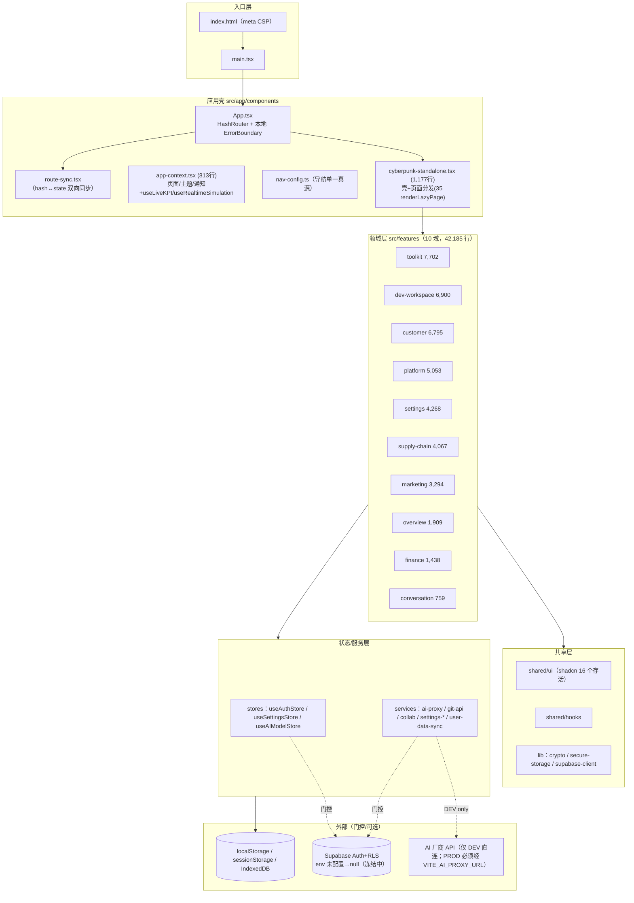
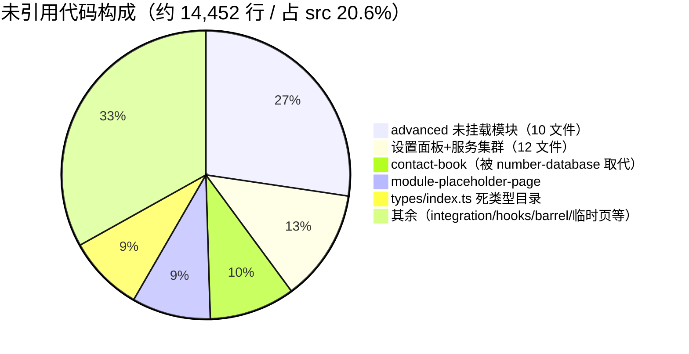
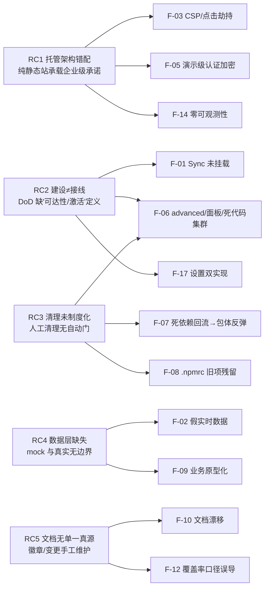
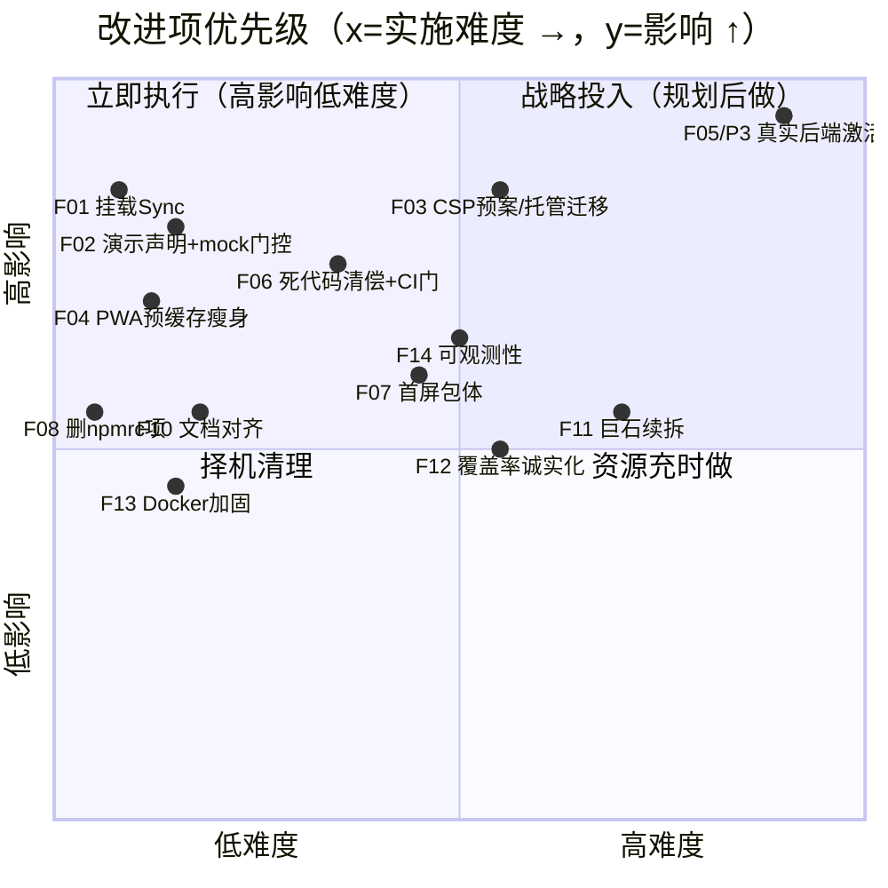

# 📊 YYC³ Administration 项目现状审核报告与总结建议

> **言启千行代码 · 语枢万物智能**
> 本报告以底层代码为唯一准绳：全部结论来自源码静态审计 + 本地实测（typecheck / lint / 639 单测 / 覆盖率 / 生产构建 / 56 项 E2E）+ 生产站点实测，不盲信历史文档与徽章。

---

## 0. 基本信息

| 属性         | 值                                                                                                                                           |
| ------------ | -------------------------------------------------------------------------------------------------------------------------------------------- |
| **项目名称** | YYC³ Administration（`@yyc3/my-mgmt`，AI 营销自动化终端/企业管理平台）                                                                       |
| **审核日期** | 2026-09-26                                                                                                                                   |
| **代码基线** | `main` 分支 `13354da`（工作区干净，无未提交变更）                                                                                            |
| **代码规模** | 189 个 TS/TSX 文件，**70,108 行**；504 个 git 跟踪文件                                                                                       |
| **技术栈**   | React 18.3.1 + TypeScript 5(strict) + Vite 6.4.3 + Tailwind 4 + Zustand 5 + Radix/shadcn + react-router 7(HashRouter) + Supabase(门控) + PWA |
| **运行环境** | Node 22.22.3 / pnpm 11.10.0；生产 GitHub Pages → <https://admin.yyc3.vip（实测在线，构建号> 20260903164924）                                 |
| **历史依据** | 2026-05 P5 结项报告（自评 87 分）、2026-08-19 深度审计（P0/P1/P2 路线）、2026-08-29 执行日志（P2 收官、P3 冻结）                             |
| **审核方法** | 源码逐文件取证 + 命令实测 + 线上探测 + 历史报告交叉验证（madge/unimported/istanbul/playwright/vite build）                                   |

---

## 1. 执行摘要

### 1.1 一句话结论

**这是一个「工程卫生已显著康复、内核质量良好，但业务功能以演示原型为主、生产级安全与数据架构尚未建成」的前端单体项目。** 2026-08 审计的 P0/P1/P2 整改绝大多数**经实测确认属实且有效**（CI 三绿、E2E 56/0、代码分割、路由化、目录重组、密钥门控均落地），但同时出现 1 个**已交付功能未接线的新缺陷（UserDataSync 未挂载）**、约 **1.4 万行死代码回流（占源码 ~20.6%）**、首屏包体较 P1 验收值**反弹约 11%**，以及 P3 真实后端/数据层仍冻结导致的**架构性安全与真实性缺口**。

### 1.2 综合评分卡（量化，六维加权）

| 维度（权重）      | 得分       | 等级   | 一句话证据                                                                                |
| ----------------- | ---------- | ------ | ----------------------------------------------------------------------------------------- |
| 架构设计（20%）   | **78/100** | B      | 路由化+features 分域+防回流 ESLint 已就位；但 49 个 >500 行文件、状态双轨、20% 死代码集群 |
| 代码质量（18%）   | **82/100** | B+     | strict 零错误 / 0 个真实 @ts-nocheck / 零循环依赖；148 lint 告警、注释头覆盖 56%          |
| 功能实现（20%）   | **60/100** | C      | 41 页面面广但多数为静态壳；假实时数据生产运行；整个 advanced 模块未挂载；P3 冻结          |
| 性能表现（15%）   | **68/100** | C+     | 35 页代码分割有效，但首屏 570.6KB gzip、单 vendor 787KB、PWA 预缓存 8.7MB                 |
| 安全与风险（17%） | **60/100** | C      | P0 止血项全部验证有效；但认证/加密仍是浏览器演示级，CSP/供应链/点击劫持有缺口             |
| 文档完整性（10%） | **70/100** | B-     | 155 篇文档体系完备；README 徽章/CHANGELOG/env 与现状明显漂移                              |
| **加权总分**      | **70/100** | **C+** | **「演示就绪（Demo-Ready）、生产未就绪（Not Production-Ready）」**                        |

```
架构设计 ███████████████████░░░░░░░░  78
代码质量 ████████████████████░░░░░░░  82
功能实现 ███████████████░░░░░░░░░░░░  60
性能表现 █████████████████░░░░░░░░░░  68
安全风险 ███████████████░░░░░░░░░░░░  60
文档完整 █████████████████░░░░░░░░░░  70
```

> 评分口径：以实测证据计数（非主观印象），与 2026-05 报告自评 87 分不可直接比较——那次评分发生在 CI 22 天红灯、E2E 结构性失效、内置账户公网暴露被揭露之前，属于证据不充分条件下的乐观自评。

### 1.3 历史趋势（基于可核验证据）

| 时间                   | 事件                   | 可核验状态                                                                   |
| ---------------------- | ---------------------- | ---------------------------------------------------------------------------- |
| 2026-05-01             | P5 结项审查（自评 87） | 当时无 CI/E2E 实测，后被证实 main CI 已长期红灯                              |
| 2026-07-16→08-19       | main CI 红灯 22+ 天    | E2E 无登录步骤 + 空转断言（详见 08-19 报告 2.3）                             |
| 2026-08-19             | P0+P1 整改             | 安全门控、死代码清理、代码分割落地（首屏 654→513KB gzip）                    |
| 2026-08-29             | P2 收官 + P3 脚手架    | HashRouter、features 重组、五巨石拆分、Supabase PKCE/RLS 代码交付后冻结      |
| **2026-09-26（本次）** | **独立复核**           | 质量门全绿；但发现功能未接线、死代码回流、包体反弹、CSP/激活阻断等 **20 项** |

---

## 2. 实测验证结果（2026-09-26 本机实测）

| 检查项                      | 命令                               | 结果                                                                 | 耗时  |
| --------------------------- | ---------------------------------- | -------------------------------------------------------------------- | ----- |
| 依赖安装                    | `pnpm install --frozen-lockfile`   | ✅ exit 0（lockfile 可复现）                                         | —     |
| 类型检查                    | `pnpm typecheck`（tsc --noEmit）   | ✅ **0 error**                                                       | ~30s  |
| Lint                        | `pnpm lint`                        | ✅ **0 error / 148 warnings**（脚本预算 `--max-warnings 320`）       | ~15s  |
| 单元测试                    | `pnpm test`                        | ✅ **42 文件 / 639 用例全通过**                                      | 46.2s |
| 覆盖率（istanbul）          | `pnpm test:coverage`               | ⚠️ S 31.73 / B 19.73 / F 34.42 / L 32.41（棘轮 31/19/34/31）         | —     |
| 生产构建                    | `pnpm build`                       | ✅ 通过（6.51s），1 个 >800KB chunk 告警                             | 6.5s  |
| E2E（chromium，装浏览器后） | `pnpm test:e2e --project=chromium` | ✅ **56 通过 / 0 失败 / 9 跳过**（6 个 spec，65 例）                 | 1.0m  |
| 循环依赖                    | `npx madge --circular src/`        | ✅ **0 循环**（189 文件）                                            | 0.9s  |
| 死代码/死依赖扫描           | `npx unimported`                   | 🔴 **46 个未引用文件（约 14,452 行）/ 26 个未用依赖 / 1 个特殊导入** | —     |
| 生产站点探测                | `curl -I https://admin.yyc3.vip`   | ⚠️ HTTP 200 在线；**无任何 HTTP 级安全头**（GitHub Pages）           | —     |

> E2E 初次运行因本机缺 chromium 二进制而 65 例全红（`Executable doesn't exist ... headless_shell-1223`），经 `npx playwright install chromium` 后 56/0——**这是环境问题不是代码问题**，CI 不受影响。

---

## 3. 架构设计评估（时间维 × 空间维）

### 3.1 当前运行时分层（实测绘制）



### 3.2 值得肯定的架构进展 ✅（对比 08-19 报告，逐项验证为真）

| 编号         | 原问题                                 | 当前状态（取证位置）                                                                                                    |
| ------------ | -------------------------------------- | ----------------------------------------------------------------------------------------------------------------------- |
| ARCH-001/2/3 | 无路由/自研状态机分发                  | ✅ `HashRouter` 已包裹（App.tsx:111），`route-sync.tsx` 处理 POP/PUSH/深链/竞态；41 页 URL 可分享，E2E NAV-007/008 守护 |
| ARCH-004     | 导航配置三处重复                       | ✅ PAGE_IDS 自 nav-config 派生，lazy-pages 注册表 35 页                                                                 |
| ARCH-005/6   | lazy 注册表死代码/preload-fix 全量同步 | ✅ lazy-pages 已接线；preload-fix 已删除；实测产出 34 个页面 chunk                                                      |
| STATE-002    | AI 配置三处并存                        | ✅ `useAIModelStore` 单一真源（zustand + secure-storage），panel-store/settings.models 明文路径已清退                   |
| i18n fork    | 内嵌 2,000 行漂移副本                  | ✅ 已换 `@yyc3/i18n-core@^2.4.2` 正式包，补丁桥接解除                                                                   |
| 目录重组     | components 平铺 198 文件               | ✅ features(10 域)/shared 分域落地，`@/` 别名统一，ESLint `no-restricted-imports` 双防回流，madge 0 循环                |
| 巨石拆分     | Top5 2k~3k 行                          | ✅ task-board/model-settings/smart-form/number-database/shell 均已拆（但见 F-11：有反弹）                               |

### 3.3 仍然存在的架构问题

| 编号    | 问题                                                                                                                                                                                                                                      | 严重度 | 证据                                                                 |
| ------- | ----------------------------------------------------------------------------------------------------------------------------------------------------------------------------------------------------------------------------------------- | ------ | -------------------------------------------------------------------- |
| ARCH-N1 | **已交付的 P3 数据同步组件未挂载**：`UserDataSync` 在 App.tsx:13 被 import，但组件树中**从未渲染**（全仓仅 2 处提及）。Supabase 激活后设置云同步不会启动，Runbook 承诺的"登录水合→变更上行"静默失效，5 个单测只测服务函数，测不出挂载缺失 | 🔴 高  | `Grep UserDataSync src` 仅命中 import 与定义；App.tsx JSX 树无该组件 |
| ARCH-N2 | **应用壳仍是巨型编排器**：cyberpunk-standalone 1,177 行 + app-context 813 行（页面/主题/通知/快捷键/假数据模拟多职责）                                                                                                                    | 🟡 中  | `wc -l`                                                              |
| ARCH-N3 | **状态双轨未收敛**：Zustand（3 store）与 React Context（App/Theme/I18n/Contacts）并存；AppContext 单上下文承载多域状态                                                                                                                    | 🟡 中  | app-context.tsx                                                      |
| ARCH-N4 | **"建设但未接线"模式反复出现**（见 §6 死代码）：advanced 整模块（3,952 行，有单测、有 5 篇用户文档）不在导航/注册表中；10 个设置面板被独立 settings 页面旁路；contact-book 被 number-database 取代                                        | 🔴 高  | unimported + lazy-pages 注册表交叉验证                               |
| ARCH-N5 | **静态托管与企业级承诺的根本错配**：认证、密钥、RBAC、业务数据、安全头全部被压在浏览器端；P3 脚手架就位但冻结 4 周未激活                                                                                                                  | 🔴 高  | supabase-client 门控为 null；线上无 HTTP 头                          |
| ARCH-N6 | `tsc -b` 的 composite 子项目（tsconfig.node.json）无 noEmit/outDir，向仓库根目录吐出 vite.config.js/.d.ts 等 6 个编译产物（未入库但污染工作区）                                                                                           | 🟢 低  | 根目录 6 个 .js/.d.ts；tsconfig.node.json:3                          |

---

## 4. 代码质量评估（属性维）

### 4.1 量化指标

| 指标                     | 数值/状态                                                      | 评价                                                                    |
| ------------------------ | -------------------------------------------------------------- | ----------------------------------------------------------------------- |
| TS strict                | ✅ 开启，typecheck 0 error                                     | 类型基座扎实                                                            |
| 真实 `any`               | 约 20 处（原 34）                                              | 集中在 git-api 映射、markdown 渲染器、`performance.memory`，可接受度高  |
| `@ts-nocheck/@ts-ignore` | **0 个真实项**（唯一命中是 mock 文案字符串）                   | 优于 08-19（lit-controller 已随 fork 删除）                             |
| 循环依赖                 | 0（madge）                                                     | 优秀                                                                    |
| ESLint                   | 0 error / **148 warning**                                      | 预算 320 过于宽松，存量告警未制度化清偿（典型：未使用变量/参数 148 处） |
| 文件头 JSDoc（@file）    | **106/189 = 56%**                                              | 规范化不均衡，新文件好、旧文件弱                                        |
| `console.log`            | 4 处                                                           | 轻微                                                                    |
| 大文件                   | **49 个 >500 行，21 个 >800 行**                               | 复杂度仍高度集中（08-19 为 42 个 >500，拆分后总数未降反升，见 F-11）    |
| 格式化/提交门            | prettier 配置齐全；husky pre-commit 实测存在并执行 lint-staged | ✅ 本地质量门有效（对比 08-19 完全失效）                                |

### 4.2 大文件 Top 10（复杂度热点）

| 文件                                             |          行数 | 说明                                                                                      |
| ------------------------------------------------ | ------------: | ----------------------------------------------------------------------------------------- |
| features/customer/pages/number-database-tabs.tsx |         2,149 | ⚠️ P2"拆分"后主文件 194 行，但复杂度整体搬入 tabs（原 3,037 行集群现 3,138 行，等于未减） |
| app/locales/zh.ts / en.ts                        | 1,829 / 1,764 | 词条文件，可接受                                                                          |
| features/toolkit/pages/task-board-components.tsx |         1,411 | task-board 拆分后的新巨石                                                                 |
| features/customer/pages/contact-book.tsx         |         1,388 | 🔴 零引用死文件                                                                           |
| features/toolkit/pages/quick-actions-page.tsx    |         1,288 | 高复杂度交互页                                                                            |
| app/components/module-placeholder-page.tsx       |         1,277 | 🔴 零引用死文件                                                                           |
| types/index.ts                                   |         1,236 | 🔴 零引用死类型目录                                                                       |
| advanced/components/advanced-features-page.tsx   |         1,207 | 🔴 未挂载模块主页                                                                         |
| app/components/cyberpunk-standalone.tsx          |         1,177 | 应用壳                                                                                    |
| features/toolkit/pages/collab-creation-page.tsx  |         1,094 | —                                                                                         |

---

## 5. 功能实现评估（事件维：需求覆盖 × 完整性 × 异常处理）

### 5.1 页面/模块真实性分层（41 个可达页面）

| 层级                  | 判定标准                                        | 代表模块                                                                                                                                                                                | 数量级  |
| --------------------- | ----------------------------------------------- | --------------------------------------------------------------------------------------------------------------------------------------------------------------------------------------- | ------- |
| **L1 有真实逻辑**     | 有 store/服务/持久化/真实异步与错误分支         | 认证、模型设置（加密+CRUD）、AI 对话（mock/代理/限流/缓存/AbortController）、任务看板（store+DnD）、智能表单（校验器矩阵）、号码库（本地数据）、开发工作台（文件树/Git API）、参数/设置 | ~14 页  |
| **L2 高保真交互原型** | 有少量状态与交互，但数据为静态/本地、无后端契约 | 财务、薪资、库存、采购、客户关怀、CLM、数据集成、渠道中心                                                                                                                               | ~18 页  |
| **L3 静态展示壳**     | 几乎无状态（0–4 hooks），硬编码内容             | 9 个智能营销页（共 3,294 行，如 nlp-processing 374 行/2 hooks、decision-support 403 行/0 hooks、smart-marketing-engine 245 行/0 hooks）                                                 | ~9 页   |
| **L0 构建但不可达**   | 不在导航/路由/注册表中                          | advanced 整模块（10 文件/3,952 行，含代码分析/MCP 编排/流水线/性能监控，**且配了 5 篇正式用户文档与 API reference**）、10 个设置面板、contact-book                                      | 46 文件 |

**需求覆盖率判断**：对照 docs/YYC3-M10《智能转型》12 篇顶层设计（智能表单自治、菜单图谱、经营/运营智能化、全局类型契约、数据库设计、各单元 API 规范），**UI 铺到了、契约和数据层未建**——需求在"页面可见性"维度覆盖约 80%+，在"功能可用性（真实数据闭环）"维度估算仅 25–30%。

### 5.2 异常处理机制抽查

| 机制        | 现状                                                                                                                                                                                   |
| ----------- | -------------------------------------------------------------------------------------------------------------------------------------------------------------------------------------- |
| 错误边界    | ✅ 存在两套：App.tsx 内联 class + shared `error-boundary.tsx`（lazy 页用，支持 name 降级）——**重复实现**（F-18）                                                                       |
| 异步取消    | ✅ AI 调用支持 AbortController（chat/面板）                                                                                                                                            |
| 服务降级    | ⚠️ secure-storage 加密失败静默吞错（有意设计，但无用户可见告警）；user-data-sync 上行失败仅 console.warn 且下次变更重试（合理）                                                        |
| 假数据误导  | 🔴 `useLiveKPI`（每 5 秒随机波动 KPI）与 `useRealtimeSimulation`（8–25 秒注入假通知）**在生产构建中持续运行**，仅 E2E 关停；dashboard 与壳都消费——用户看到的"实时"数据是随机数（F-02） |
| 空态/错误态 | 业务静态壳普遍缺少 loading/error/empty 三态（无真实请求所致）                                                                                                                          |

### 5.3 本轮新发现的功能缺陷（独立于历史报告）

1. **F-01（🔴）UserDataSync 未挂载**——P3-11.3 交付物激活即失效（详见 ARCH-N1）。
2. **F-02（🔴）生产假实时数据 + 无演示声明**——全仓搜索"演示环境/请勿输入真实凭据"**零命中**；公网用户在登录页输入的信息、在设置页填入的 Key 面对的是演示级保护。
3. **F-03（🟡）`payloadToSettings` 含永不抛错的 try/catch**（user-data-sync.ts:33-40，死异常处理，建议项）。

---

## 6. 死代码与技术债务（空间维）

### 6.1 量化（unimported + 人工交叉验证，剔除误报后）



- **46 个文件从生产入口不可达**；其中 advanced 模块与 settings-search 仅被单测引用（**测试给不可达代码上了保险，更具迷惑性**）。
- **26 个 npm 依赖零源码消费**：19 个 `@radix-ui/*` + embla-carousel + input-otp + react-day-picker + react-hook-form + react-resizable-panels + tw-animate-css + vaul。
- 根因链：P1 曾删除 39 个依赖与 86 个文件 → 随后 `shadcn 依赖补齐` 等提交把 Radix 全家桶**重新装回**，而消费它们的 ui 组件已被删除；advanced/设置面板属于"功能做了但接线决策没做"。
- **防护缺失**：madge/unimported 已在 devDependencies 但**未接入 CI**（08-19 报告 P3-3 建议，未执行），死代码回流无制动。

---

## 7. 性能与包体（时间维）

### 7.1 实测构建产物（2026-09-26）

| chunk                                     |             raw |         gzip | 加载时机                             |
| ----------------------------------------- | --------------: | -----------: | ------------------------------------ |
| vendor.js（Radix 25 包+motion+cmdk+dnd…） |       787.23 KB |    230.12 KB | **首屏**                             |
| index.js（应用代码）                      |       456.83 KB |    123.98 KB | **首屏**                             |
| vendor-charts（recharts/d3）              |       388.28 KB |    101.95 KB | **首屏**（dashboard eager 静态引入） |
| vendor-markdown（highlight.js/remark…）   |       284.04 KB |     84.08 KB | **首屏**（chat eager 静态引入）      |
| vendor-react                              |       143.38 KB |     45.94 KB | **首屏**                             |
| **首屏 JS 合计（实测 gzip 求和）**        | **2,059.76 KB** | **570.6 KB** | 另加 CSS 119KB（gzip 19.6KB）        |
| vendor-monaco（懒加载，仅工作台用）       |     3,716.59 KB |    961.23 KB | 按需                                 |
| 34 个页面 chunk                           |    10–130 KB/个 |  2.7–35.7 KB | 路由按需 ✅                          |

```
首屏 gzip 载荷：570.6 KB JS + 19.6 KB CSS
对标：README 目标 <500KB 总包体；行业良好实践首屏 JS gzip <300KB
```

### 7.2 性能发现

| 编号    | 发现                                                                                                                                                                                                                        | 严重度               |
| ------- | --------------------------------------------------------------------------------------------------------------------------------------------------------------------------------------------------------------------------- | -------------------- |
| PERF-N1 | **较 P1 验收反弹**：08-19 记录首屏 1,768KB/513KB gzip → 现在 2,060KB/570.6KB（raw +16% / gzip +11%）。死依赖回流进 vendor 是主因                                                                                            | 🟡 中                |
| PERF-N2 | **PWA 预缓存 87 项 / 8,707 KiB**（08-19 为 4.5MB）：Monaco 本地化修复时把 `maximumFileSizeToCacheInBytes` 提到 5MB，3.7MB 的 vendor-monaco 被 glob 全量预缓存——**绝大多数用户从不用工作台编辑器，却在首访被强制缓存 3.7MB** | 🔴 高（弱网/移动端） |
| PERF-N3 | 单 vendor 787KB 未再细分；charts/markdown 因 dashboard/chat eager 而进入首屏（P1 已识别并挂起，未处理）                                                                                                                     | 🟡 中                |
| PERF-N4 | App.tsx:21-30 版本变更时清空**全部** Cache Storage，副作用粗暴（会连其他懒缓存一起删）                                                                                                                                      | 🟢 低                |
| 正面    | 34 页面 chunk 按需；构建仅 6.51s；Monaco 已脱离 CDN（消除弱网死等，08-29 CI flake 根因已除）；E2E 全套 1 分钟                                                                                                               | ✅                   |

---

## 8. 安全审计（关联维）

### 8.1 P0 止血项——逐项复核为真 ✅

| 原编号      | 事项                         | 2026-09-26 取证                                                                                                     |
| ----------- | ---------------------------- | ------------------------------------------------------------------------------------------------------------------- |
| SEC-001~003 | 内置账户/明文凭据/GHOST 登录 | ✅ 全部 `import.meta.env.DEV` 门控（useAuthStore.ts:117、auth-context.tsx:33-36,584），生产构建静态剔除             |
| SEC-009     | AI Key 明文 localStorage     | ✅ 迁移 secure-storage（AES-GCM + 旧明文一次性迁移），单一真源 useAIModelStore                                      |
| SEC-010/011 | 生产浏览器持 key 直连        | ✅ `chat()` 路由：无代理且非 DEV 时**抛错失败**（ai-proxy-service.ts:246-257）                                      |
| SEC-016~018 | CI 权限/SHA 固定/扫描        | ✅ ci.yml `permissions: contents: read`、全部 actions 钉 SHA、codeql.yml + dependabot.yml 在册；deploy.yml 最小权限 |
| HYG-001     | husky 钩子缺失               | ✅ `.husky/pre-commit` 存在并执行 `pnpm lint-staged`                                                                |

### 8.2 仍然存在的风险（按严重度）

| 编号   | 风险                                                                                                                                                                                                                                                                                                                                                           | 严重度                                               | 位置/说明 |
| ------ | -------------------------------------------------------------------------------------------------------------------------------------------------------------------------------------------------------------------------------------------------------------------------------------------------------------------------------------------------------------- | ---------------------------------------------------- | --------- |
| SEC-N1 | **认证体系整体是演示级**：用户库/会话仍存浏览器；密码为**无盐单次 SHA-256**（crypto.ts:121-127，注释自认 demo）；任何能写 localStorage 的脚本即可伪造会话。真实 Supabase 认证代码已就绪但未激活                                                                                                                                                                | 🔴 高（生产承载真实数据前必须解决）                  |
| SEC-N2 | **"加密"是混淆不是安全**：`APP_SECRET='YYC3-Administration-v1-2026'` 硬编码进 bundle + sessionStorage 随机盐，密文/盐/算法对同源攻击者全部可见；且盐在 sessionStorage 导致**"记住我 7 天"跨标签/重开浏览器失效**                                                                                                                                               | 🟡 中（架构限制，P3 后端化才能根治；注释已诚实声明） |
| SEC-N3 | **CSP 三重问题**：①`script-src 'unsafe-inline'`；②**`frame-ancestors` 无法用 meta 表达**，GitHub Pages 不发 HTTP 头 → 点击劫持实际无防护（线上响应头实测仅 server/content-type/cache-control）；③ `connect-src` 白名单**不含 Supabase 域名与任意 AI 代理域名**——按 Runbook 激活 P3 会立即触发 CSP 违规，属激活阻断项；且白名单保留 `http://localhost:*` 到生产 | 🔴 高（其中③直接阻断既定路线）                       |
| SEC-N4 | **`.npmrc: minimum-release-age=0`**：08-19 从 CI 环境变量移除的供应链冷却期关闭项，在项目级 .npmrc 存活，对所有安装（含 CI frozen 安装）生效                                                                                                                                                                                                                   | 🟡 中                                                |
| SEC-N5 | 容器化部署无防护：**无 .dockerignore**（`COPY . .` 会带入本地 .env/node_modules/coverage）；nginx 配置**零安全头**（连 meta CSP 都没有）、无 healthcheck                                                                                                                                                                                                       | 🟡 中                                                |
| SEC-N6 | GitHub PAT 存浏览器 localStorage 调 api.github.com（git-api-service）；`signRequest` 仍是 btoa 非签名（低风险，仅到自有代理时有意义）                                                                                                                                                                                                                          | 🟡 中 / 🟢 低                                        |
| SEC-N7 | 注册无验证码/限流（本地演示模式下影响小，接 Supabase 后需在服务端补）                                                                                                                                                                                                                                                                                          | 🟢 低                                                |
| SEC-N8 | 零运行时可观测性：Sentry/错误上报/analytics 的 env 开关**源码零消费**（7 个文档化环境变量全是死配置）；生产故障不可见                                                                                                                                                                                                                                          | 🟡 中                                                |

> 平衡说明：AES-256-GCM + PBKDF2 150k 参数正确、时序安全比较到位、.env 从未入库、anon key 模型正确（RLS 在库端）、迁移 SQL 质量高（角色列属主不可变触发器 + 256KB 护栏 + 四操作 RLS）。**问题集中在密钥管理模型与托管环境，不在编码能力。**

---

## 9. 文档完整性评估

| 项            | 现状                                                                                                                                                                                                                                                                                                                                | 评分依据       |
| ------------- | ----------------------------------------------------------------------------------------------------------------------------------------------------------------------------------------------------------------------------------------------------------------------------------------------------------------------------------- | -------------- |
| 文档体量      | **155 篇 markdown** + 12 篇智能转型顶层设计 + advanced-features 5 篇（设计/API/最佳实践/用户手册/开发者指南）+ Runbook                                                                                                                                                                                                              | 体系完备，加分 |
| README        | 双语详尽、徽章齐全，但**事实漂移**：`954 passed`（实际 639 单测）、`62 E2E`（实际 65：56+9skip）、覆盖率"22%→85%"（当前 31.7%/排除口径）、**"10 种语言实时切换"（引擎仅注册 zh-CN/en 两套词条，其余 8 种回落）**、项目结构仍是重组前目录（src/lib/i18n、ui 48 个）、Vite 徽章 6.3.5（实际 6.4.3）；中文区 954 与英文区 864 自相矛盾 | 🔴 可信度损耗  |
| CHANGELOG     | 停在 **1.0.3 / 2026-07-12**；8-19/8-29 的安全止血、CI 修复、路由化、目录重组、Supabase 脚手架等**最关键变更全部未入 CHANGELOG**（仅存于审计执行日志）                                                                                                                                                                               | 🔴             |
| .env.example  | `VITE_APP_VERSION=1.0.2`（实际 1.0.3）；edge-proxy 路径仍写旧位（已移 docs/design-references）；**7 个变量源码零消费**（AI_API_BASE_URL/ENABLE_ANALYTICS/DEV_TOOLS/CACHE_TTL/RATE_LIMIT_RPS/APP_VERSION/ERROR_REPORTING）；Supabase 变量有文档 ✅                                                                                   | 🟡             |
| 历史文档      | M01/P5 等大量引用重组前路径（src/app/components/...），无归档标注，新人易被误导                                                                                                                                                                                                                                                     | 🟡             |
| 设计-实现鸿沟 | advanced-features 的用户手册/API 文档完整，但模块本身不可达（L0）；M10 宏大设计与营销静态壳并存                                                                                                                                                                                                                                     | 🟡             |

---

## 10. 关键发现总表（按严重度分级）

| ID   | 级别　  | 发现　　　　　　　　　　　　　　　　　　　　　　　　　　　　　　　　　　　　　　　　　　　　　　　　　　　　　　　　　　　　　　　　　　　　　　                                                                                                                                                                                                                                                                                                                                                         | 维度　　　 | 根因归类　　　　　　　　　　　　 |
| ---- | ------- | -------------------------------------------------------------------------------------------------------------------------------------------------------------------------------------------------------------------------------------------------------------------------------------------------------------------------------------------------------------------------------------------------------------------------------------------------------------------------------------------------------- | ---------- | -------------------------------- |
| F-01 | 🔴 P0   | ~~UserDataSync 已导入未挂载，P3 数据面激活即静默失效~~ ✅ **2026-09-26 已修复**：App.tsx 已挂载 + 5 例回归测试（含 App 树挂载守卫，变异验证有效）                                                                                                                                                                                                                                                                                                                                                        | 功能/架构  | 接线缺口；无"可达性"验收　　　　 |
| F-02 | 🔴 P0   | ~~生产运行假 KPI/假通知且公网无"演示环境"风险声明~~ ✅ **2026-09-26 已修复**：`MOCK_REALTIME_ENABLED` 生产门控（DEV 开/生产关/`VITE_ENABLE_MOCK` 显式开）+ `DemoEnvironmentBanner` 演示警示横幅（Supabase 未配置时全页面展示、可关闭、session 级）　　　　　　　　　　　　　　　　　　　　　　　　　　　　　　　　　　　　　　　　　　　　　　　　　                                                                                                                                                     | 功能/信任  | mock 与真实无边界　　　　　　　  |
| F-03 | 🔴 P0   | ~~CSP 不含 Supabase/代理域名（激活阻断）+ frame-ancestors 在 GH Pages 不可实施 + unsafe-inline~~ ✅ **2026-09-26 已修复（unsafe-inline 与 HTTP 头除外，见备注）**：connect-src 补 `https/wss://*.supabase.co`；新增 csp-harden 构建插件（生产移除 localhost 回环、按 VITE_AI_PROXY_URL 自动注入代理源）；移除伪安全 meta（X-Frame-Options/X-Content-Type-Options），加内联 frame-busting 兜底。遗留：unsafe-inline 需 nonce 化、真实安全头需迁移托管　　　　　　　　　　　　　　　　　　　　　　　　　　 | 安全　　　 | 托管选型能力缺口　　　　　　　　 |
| F-04 | 🔴 P0   | ~~PWA 首访预缓存 8.7MB（含 3.7MB Monaco）~~ ✅ **2026-09-26 已修复**：单文件上限恢复 2MiB + globIgnores 排除 monaco，预缓存 87 条/8,707 KiB → **85 条/5,062 KiB（-42%）**，monaco 改由 static-assets 运行时缓存按需缓存　　　　　　　　　　　　　　　　　　　　　　　　　　　　　　　　　　　　　　　　　　　　　　　　　　　　　                                                                                                                                                                        | 性能　　　 | 修 CDN flake 时的策略副作用　　  |
| F-05 | 🔴 P1   | 演示级认证/加密仍在生产路径（无盐 SHA-256、硬编码 APP_SECRET、本地会话）　　　　　　　　　　　　　　　　　　　　　　　　　　　　　　　　　　　　                                                                                                                                                                                                                                                                                                                                                         | 安全　　　 | P3 未激活（架构性，路线已备）　  |
| F-06 | 🟡 P1　 | ~~46 个未引用文件约 1.45 万行（20.6%）+ 26 个死依赖，advanced 整模块不可达~~ ✅ **2026-09-26 已修复**：删 45 文件（约 1.4 万行，含 advanced+5 文档/10 面板/contact-book 等）+6 保活测试（净删 94 用例）+25 死依赖（tw-animate-css 为 CSS 引用误报保留）；unimported 复检 0/0；CI 死代码 0 容忍门防回流　　　　　　　　　　　　　　　　　　　　　　　　　　　　　　　　　　　　                                                                                                                           | 技术债　　 | 无自动化死代码门；建设-接线脱节  |
| F-07 | 🟡 P1　 | ~~首屏 570.6KB gzip，较 P1 反弹 11%；vendor 787KB；charts/markdown eager~~ ✅ **2026-09-26 已修复**：首屏 gzip **398.0KB（-30%，达成 <400KB 目标）**——dashboard/chat/forms 转懒加载注册表；破除 vendor↔vendor-markdown 循环 chunk（manualChunks 纯叶子化），charts/markdown 彻底移出首屏　　　　　　　　　　　　　　　　　　　　　　　　　　　　　　　　　　　　　                                                                                                                                       | 性能　　　 | 死依赖回流 + 既有挂起项　　　　  |
| F-08 | 🟡 P1　 | ~~`.npmrc minimum-release-age=0` 关闭供应链冷却期~~ ✅ **2026-09-26 已修复**：`.npmrc` 与 `pnpm-workspace.yaml` 双处关闭项均恢复 1440（审计时未发现 workspace 中的第二处）　　　　　　　　　　　　　　　　　　　　　　　　　　　　　　　　　　　　　　　　　　　　　　　　　                                                                                                                                                                                                                             | 安全　　　 | 修复迁移不彻底　　　　　　　　　 |
| F-09 | 🟡 P1　 | 业务功能以 L2/L3 原型为主（真实数据闭环估算 25–30%），与"企业级平台"定位/M10 设计落差大　　　　　　　　　　　　　　　　　　　　　　　　　　　　　                                                                                                                                                                                                                                                                                                                                                        | 功能　　　 | 数据层未立　　　　　　　　　　　 |
| F-10 | 🟡 P1　 | ~~README/CHANGELOG/.env.example 系统性漂移（测试数/语言/结构/版本/死变量）~~ ✅ **2026-09-26 已修复**：README 中英两区全面对齐（651 单测/56 E2E 徽章、覆盖率口径注明、i18n 改中英双语、项目结构→features/shared 实况、Provider 树补 HashRouter/RouteSync/UserDataSync/DemoEnvironmentBanner、Vite 6.4.3、安全章节重写）；CHANGELOG 补 1.0.4（含 08-19/08-29 未记录整改）；.env.example 清 13 个死变量；版本三处对齐（package.json/version.ts → 1.0.4）                                                   | 文档　　　 | 文档手工维护、无校验　　　　　　 |
| F-11 | 🟡 P2　 | ~~49 个 >500 行（21 >800）；number-database 拆分后复杂度搬位未减量；shell 1,177；task-board-components 1,411~~ ✅ **2026-09-26 部分修复**：两大巨石按域拆完——number-database-tabs 2,149→barrel+8 域文件（208~461 行/个）；task-board-components 1,411→barrel+7 组件文件；连带清 219 个未用 import。遗留：cyberpunk-standalone 1,177、quick-actions 1,288 等次级巨石　　　　　　　　　　　　　　　　　　　                                                                                                | 质量　　　 | 拆分以行数为目标而非边界　　　　 |
| F-12 | 🟡 P2　 | ~~覆盖率分母排除全部业务页面，31.7% 仅代表基础设施层；页面真实单测≈0~~ ✅ **2026-09-26 已修复（口径透明化）**：双口径公示——排除口径 S 44.7%（CI 棘轮）/ 全口径 S 19.8%（`pnpm test:coverage:all`，业务页面计入）；README 同步双数字　　　　　　　　　　　　　　　　　　　　　　　　　　　　　　　　　　　　　　　                                                                                                                                                                                        | 质量　　　 | 覆盖率口径不透明　　　　　　　　 |
| F-13 | 🟡 P2　 | Docker 无 .dockerignore、nginx 无安全头/healthcheck　　　　　　　　　　　　　　　　　　　　　　　　　　　　　　　　　　　　　　　　　　　　　　　                                                                                                                                                                                                                                                                                                                                                        | 安全/部署  | 部署件未跟随 P0 加固　　　　　　 |
| F-14 | 🟡 P2　 | 零错误监控/上报（Sentry 等死配置），生产不可观测　　　　　　　　　　　　　　　　　　　　　　　　　　　　　　　　　　　　　　　　　　　　　　　　                                                                                                                                                                                                                                                                                                                                                         | 运维　　　 | P3 未启动　　　　　　　　　　　  |
| F-15 | 🟢 P2　 | ~~`tsc -b` 向根目录吐编译产物（composite 配置缺陷）~~ ✅ **2026-09-26 已根治（F-07 实测升级为高危后）**：陈旧 vite.config.js 曾屏蔽 vite.config.ts 修改（Vite .js 优先解析）；outDir 重定向 node_modules/.cache/tsc-node，根目录 6 产物删除　　　　　　　　　　　　　　　　　　　　　　　　　　　　　　　　　　　　　　　　　　　　　　　　                                                                                                                                                              | 工程卫生　 | 配置缺 noEmit/outDir　　　　　　 |
| F-16 | 🟢 P2　 | ~~148 lint 告警长期挂账（预算 320 反向固化）~~ 🔄 **2026-09-26 进展**：147→**107**（F-11 拆分顺带清 219 个未用 import）；预算 320 未收紧，继续挂账　　　　　　　　　　　　　　　　　　　　　　　　　　　　　　　　　　　　　　　　　　　　　　　　　　　                                                                                                                                                                                                                                                 | 质量　　　 | 棘轮只用于覆盖率　　　　　　　　 |
| F-17 | 🟢 P3　 | 设置体系双实现（10 个孤儿面板 vs standalone 内联页）并存　　　　　　　　　　　　　　　　　　　　　　　　　　　　　　　　　　　　　　　　　　　　                                                                                                                                                                                                                                                                                                                                                         | 架构　　　 | 重构收口未决策　　　　　　　　　 |
| F-18 | 🟢 P3　 | 两套 ErrorBoundary；4 处 console.log；脚本硬编码绝对路径　　　　　　　　　　　　　　　　　　　　　　　　　　　　　　　　　　　　　　　　　　　　                                                                                                                                                                                                                                                                                                                                                         | 质量　　　 | 细节　　　　　　　　　　　　　　 |
| F-19 | 🟢 P3　 | 注册无限流/验证码（接真实后端前需补）　　　　　　　　　　　　　　　　　　　　　　　　　　　　　　　　　　　　　　　　　　　　　　　　　　　　　　                                                                                                                                                                                                                                                                                                                                                        | 安全　　　 | 依赖 P3　　　　　　　　　　　　  |
| F-20 | 🟢 P3　 | user-data-sync 死 catch；App 清缓存副作用过宽　　　　　　　　　　　　　　　　　　　　　　　　　　　　　　　　　　　　　　　　　　　　　　　　　　                                                                                                                                                                                                                                                                                                                                                        | 质量　　　 | 细节　　　　　　　　　　　　　　 |

---

## 11. 根因分析（五条根因，映射全部发现）



**最高杠杆判断**：RC2（接线缺口）与 RC3（无自动门）成本最低、收益最快——F-01 一行 JSX 即可修复，CI 加一道 unimported 即可锁死 20% 死代码回流；RC1/RC4 是战略级投入（P3 后端化），决定平台能否从"演示"走向"生产"。

---

## 12. 改进建议（含技术方案 + 代码示例 + 实施步骤）

### 12.1 P0 — 1 周内（低工时、高确定性）

**① 修复 F-01：挂载 UserDataSync（约 2 行 + 1 个回归测试）** ✅ **已于 2026-09-26 完成**：App.tsx 在 AppProvider 内、RouteSync 之后挂载；回归测试见 `tests/components/user-data-sync.test.tsx`（5 例），其中 App 树挂载守卫经"摘除即失败"变异验证。下方代码即最终落地方案：

```tsx
// src/app/App.tsx —— 置于 AppProvider 内（需同时访问 auth 状态）
<AuthProvider>
  <AppProvider>
    <RouteSync />
    <UserDataSync /> {/* ← 补齐：P3 数据面生命周期挂载件 */}
    <ContactsProvider>
      <AppContent />
    </ContactsProvider>
  </AppProvider>
</AuthProvider>
```

回归测试：渲染 App，注入 `VITE_SUPABASE_*`（vitest stub env），断言 SIGNED_IN 事件后 `startSync` 被调用；并在 PR 模板加入"新增 Provider/挂载件必须在组件树有落点"检查项。

**② F-02：演示声明 + mock 边界（半天）** ✅ **已于 2026-09-26 完成**：

- `app-context.tsx` 新增 `MOCK_REALTIME_ENABLED = !E2E_MODE && (DEV || VITE_ENABLE_MOCK==='true')`，`useLiveKPI`/`useRealtimeSimulation` 改用此门控（生产默认关，DEV 默认开）；
- 新增 `DemoEnvironmentBanner`（Supabase 未配置时于所有页面含登录页顶部固定展示双语风险警示，可关闭，sessionStorage 级，自测量高度为 body 加 padding-top 且 pointer-events 穿透不拦截交互），在 App.tsx 根树挂载；
- `global.d.ts`/`.env.example` 增补 `VITE_ENABLE_MOCK`；回归测试 7 例（横幅 4 + mock 门控 3）。

**③ F-03/F-04：CSP 激活预案 + PWA 预缓存瘦身（半天）** ✅ **已于 2026-09-26 完成**（实测：代理源注入/localhost 剥离均验证；预缓存 8,707→5,062 KiB。遗留：`unsafe-inline` nonce 化与真实安全头属 P2/P3 托管迁移项）：

```ts
// vite.config.ts —— Monaco 改运行时缓存，不进首访预缓存
workbox: {
  maximumFileSizeToCacheInBytes: 3 * 1024 * 1024, // 回落，阻止 3.7MB 入 precache
  globIgnores: ['**/vendor-monaco*.js', '**/vendor-monaco*.css'],
  runtimeCaching: [
    // 既有规则…
    { urlPattern: /vendor-monaco.*\.(js|css)$/i, handler: 'CacheFirst',
      options: { cacheName: 'monaco-lazy', expiration: { maxEntries: 4, maxAgeSeconds: 60*24*60*60 } } },
  ],
}
```

CSP：在 `.env.example`/Runbook 中把 CSP 变更列为激活前置步骤（connect-src 追加 `${SUPABASE_URL}` 与代理域）；中期把托管从 GitHub Pages 迁到 **Cloudflare Pages/Netlify（支持 `_headers` 文件）**，才能下发 `frame-ancestors 'none'`、真实 CSP 与安全头；过渡期可加 JS frame-busting 兜底。同时从生产 CSP 移除 `http://localhost:*`（用单独 dev index 模板或构建时注入）。

**④ F-08：删除 `.npmrc` 中 `minimum-release-age=0`**（冷却期恢复默认；如个别新包必须用，在当次安装命令显式声明并登记原因）。

**⑤ F-10 紧急文档对齐（半天）** ✅ **已于 2026-09-26 完成**（README 徽章以最终实测 651 单测 + 56 E2E 为准；版本发布为 v1.0.4）：README 徽章改"639 单测 + 56 E2E"、覆盖率注明排除口径、i18n 改"中英完整、8 语种词条待补"、结构/版本号刷新；CHANGELOG 补 1.0.4 段落（安全止血/CI/路由/重组/Supabase 脚手架）；.env.example 清死变量、修版本与路径。

**验收门**：typecheck/lint/639 单测/build/56 E2E 全绿 + 预缓存 <5MB + 全仓 grep 无未挂载新增挂载件。

### 12.2 P1 — 2~3 周（止血与防回流）

| 工作项          | 技术方案                                                                                                                                                                                                                     | 预估     |
| --------------- | ---------------------------------------------------------------------------------------------------------------------------------------------------------------------------------------------------------------------------- | -------- |
| F-06 死代码清偿 | 四象限处置：**advanced 模块**（产品决策：挂载进导航 or 删除，勿继续保留"带文档的不可达代码"）；**10 设置面板**（删除或替换 standalone 内联实现，二选一）；contact-book/module-placeholder/types-index 直接删；清 26 个死依赖 | 3~5 人日 |
| F-06 防回流     | CI 增加 unimported 步骤 + `.unimportedrc.json`（把 tests 配为 entry 以消除误报），未引用文件数=0 门禁；已装的 madge 同理接 CI                                                                                                | 0.5 人日 |
| F-07 包体       | ①清死依赖后 vendor 预计降至 ~600KB；②dashboard 的 recharts 与 chat 的 markdown/highlight 改路由级/组件级懒加载（首屏不进 charts/markdown）；③vendor 再拆 motion/dnd 叶子包。目标：**首屏 gzip <400KB**                       | 3~5 人日 |
| F-16 告警清偿   | lint 预算按月棘轮 320→148→64→0（先消未使用变量类）                                                                                                                                                                           | 2 人日   |
| F-13 部署加固   | 新增 `.dockerignore`（node_modules/dist/coverage/.env/.git）；nginx 补 CSP/X-Frame-Options/X-Content-Type-Options/Referrer-Permissions-Policy 与 `add_header`；加 HEALTHCHECK                                                | 0.5 人日 |
| F-15 构建卫生   | tsconfig.node.json 加 `"noEmit": true`（TS 5.x build 模式支持）或 outDir 指向 `node_modules/.cache/tsc`；删除根目录 6 个产物                                                                                                 | 0.2 人日 |

**包体优化示例（charts 懒加载）**：

```tsx
// dashboard-page.tsx：首屏不付 recharts 成本
const KpiCharts = lazy(() => import('./kpi-charts').then(m => ({ default: m.KpiCharts })))
<Suspense fallback={<ChartSkeleton />}><KpiCharts /></Suspense>
```

### 12.3 P2 — 1~2 月（架构归位与真实度）

1. **激活 P3 一期（F-05 根治前提）**：按 `docs/design-references/P3-DATA-PHASE1-RUNBOOK.md` 4 步激活 Supabase（建项目→执行已就绪的 0001 迁移 SQL→注入 env→**先改 CSP**）；激活后认证走 PKCE 真实会话、RBAC 取 `app_metadata.role`、设置云同步经已交付的适配层；移除本地无盐 SHA-256 路径（仅保留 DEV 演示）。
2. **巨石继续拆（F-11）**：以"职责边界"而非行数为目标——number-database-tabs 2,149 行按 Tab 域切片；task-board-components 1,411 抽 hooks+子组件；壳 JSX 深拆（08-19 已注明待状态图分析）。
3. **测试与覆盖率诚实化（F-12）**：覆盖率报告同时输出"全口径"与"排除口径"两组数字；业务页优先用组件测试补关键交互（目标全口径行覆盖 ≥40%、基础设施层 ≥60%）；E2E 从冒烟扩展到主业务旅程（营销→客户→表单）。
4. **mock 分层（F-09）**：建 `src/mocks/` 收口所有静态/随机数据，按域定义"真实契约 TODO 清单"；每季度对照 M10 设计核对契约差距，把 L3 静态壳按业务优先级逐个转 L1。
5. **可观测性（F-14）**：接 Sentry（sourcemap + 仅生产）或轻量自建上报；删除/接线 7 个死环境变量。

### 12.4 P3 — 战略级（季度）

> **⚠️ 决策变更（2026-09-26）**：用户决定**放弃 Supabase 激活，改为本地数据库架构**。
> 选型与实施指导见《[05-本地数据库替代方案分析.md](./05-本地数据库替代方案分析.md)》：
> 推荐 **Dexie.js**（IndexedDB，~25KB，liveQuery×Zustand），三阶段——A 数据收口
> （contacts/tasks/settings/聊天历史→单一 yyc3-db + localStorage 一次性迁移）→
> B 本地账户库（PBKDF2+vault，替换无盐 SHA-256，顺带修 SEC-N2 跨标签失效）→
> C JSON 导出/导入同步出口（复用 UserDataSync 生命周期，Supabase 适配器休眠保留）。
> 下文原 Supabase 路线保留作历史参考。

延续 08-19 报告第 11 章选型（本报告认同，不重复论证）：Supabase Auth + Postgres/RLS 三期推进；AI 推理层在"云边代理"与"family-ai-agents + BFF（治理中枢：审计/预算/熔断，对外对齐 MCP/A2A）"两路线间尽快决策；托管迁移到支持 HTTP 头/边缘函数的平台，一次性解决 SEC-N3 与 AI 代理落点。

---

## 13. 实施优先级矩阵（影响 × 难度）



| 序  | 事项                               | 影响范围          | 难度 | 资源                 | 建议窗口   |
| --- | ---------------------------------- | ----------------- | ---- | -------------------- | ---------- |
| 1   | F-01 挂载 UserDataSync + 回归测试  | 数据面可信度      | 极低 | 0.2 人日             | **立即**   |
| 2   | F-04 Monaco 移出预缓存             | 全部首访/移动用户 | 极低 | 0.2 人日             | **立即**   |
| 3   | F-08 删 .npmrc 冷却期关闭项        | 供应链安全        | 极低 | 5 分钟               | **立即**   |
| 4   | F-02 演示横幅 + mock 开关          | 全部公网访客      | 低   | 0.5 人日             | 3 日内     |
| 5   | F-10 文档/徽章/CHANGELOG 对齐      | 项目可信度        | 低   | 0.5 人日             | 3 日内     |
| 6   | F-03 CSP 激活预案（+中期托管迁移） | P3 前置           | 中   | 1 人日 + 迁移决策    | 1 周内预案 |
| 7   | F-06 死代码清偿 + unimported CI    | 20% 代码面        | 中   | 4~6 人日             | 2 周内     |
| 8   | F-07 首屏 <400KB gzip              | 性能体验          | 中   | 3~5 人日             | 2~3 周     |
| 9   | F-13/F-15/F-16 部署与工程卫生      | 交付质量          | 低   | 3 人日               | 随 P1      |
| 10  | F-05 Supabase 一期激活             | 安全/真实度根基   | 高   | 3~7 人日 + 账号/域名 | 1~2 月     |
| 11  | F-11/F-12 巨石与覆盖率             | 可维护性          | 高   | 8~12 人日            | 1~2 月     |
| 12  | P3 后端化 + BFF + 可观测性         | 平台存亡          | 极高 | 季度级专项           | Q4 立项    |

---

## 14. 验收指标建议（数据驱动的"完成"定义）

| 指标                   |             当前值 |                   P0 后目标 |               P2 后目标 |
| ---------------------- | -----------------: | --------------------------: | ----------------------: |
| 单测 / E2E             | 639 全绿 / 56 通过 | 不减少 + Sync 挂载回归 1 例 |       全口径行覆盖 ≥40% |
| 首屏 JS gzip           |           570.6 KB |                     <530 KB |             **<400 KB** |
| PWA 预缓存             |          8,707 KiB |              **<4,500 KiB** |              <3,000 KiB |
| 未引用文件 / 死依赖    |            46 / 26 |                      不新增 |    **0 / 0（CI 门禁）** |
| ESLint warnings        |    148（预算 320） |             预算下调至 ≤160 |                       0 |
| 生产可达的"假实时"数据 |         2 处运行中 |                    生产关闭 | mock 全部收口 src/mocks |
| HTTP 安全头            |        仅 meta CSP |            CSP 激活预案就绪 |    真实头下发（迁托管） |
| 真实数据闭环页面占比   |            ~25–30% |                        不变 |   ≥50%（Supabase 二期） |

---

## 15. 附录：证据索引与快速恢复

### 15.1 关键证据文件

- 组件树缺挂载：`src/app/App.tsx:13`（import）对照 JSX 树无 `<UserDataSync/>`
- 服务层：`src/services/user-data-sync.ts`、`src/app/components/user-data-sync.tsx`
- 安全：`src/stores/useAuthStore.ts:117`、`src/lib/crypto.ts:121-127`、`src/lib/secure-storage.ts:27`、`src/services/ai-proxy-service.ts:246-257`
- CSP：`index.html:20-23`；PWA：`vite.config.ts:62-91`；供应链：`.npmrc:1`
- 死代码：`unimported` 输出（46/26）；未挂载模块：`src/app/components/advanced/**`、`src/features/settings/panels/**`
- 假数据：`src/app/components/app-context.tsx:558-633`（消费方：dashboard-page、cyberpunk-standalone）
- CI/部署：`.github/workflows/ci.yml`、`Dockerfile`（无 .dockerignore）
- 历史基线：`docs/YYC3-闭环审核-报告建议/YYC3-深度分析与完善建议-2026-08-19.md`

### 15.2 快速恢复命令

```bash
cd /Users/yanyu/YYC-Cube/YYC3-Administration
pnpm install --frozen-lockfile
pnpm typecheck && pnpm lint
pnpm test                      # 639 单测
pnpm test:coverage             # 覆盖率（注意排除口径）
pnpm build                     # 观察 chunk 表与 precache 体积
npx playwright install chromium && pnpm test:e2e --project=chromium   # 56 通过
npx madge --circular --extensions ts,tsx src/
npx unimported                 # 死代码/死依赖门禁
```

### 15.3 下次会话起点（TOP 3）

1. **[P0]** 落 12.1 的 5 项（Sync 挂载 / 演示声明+mock 开关 / PWA 瘦身 / 删 .npmrc 项 / 文档对齐），合计约 1.5 人日；
2. **[P1]** advanced 模块产品决策（挂载 or 删除）→ 死代码清偿 → unimported 入 CI；
3. **[决策]** P3 激活排期：Supabase 账号/域名 + CSP 托管选型（是否迁 Cloudflare Pages），这是 F-03/F-05/F-14 的共同前置。

---

**审核结论**：**有条件通过（C+，70/100）——可继续作为演示/验证平台公网运行，但在 P3 真实认证与数据层激活、安全头与 mock 边界补齐前，不得承载真实业务数据与真实密钥。** P0 五项为近一周内的必办事项，均为低工时高确定性修复。

> 万象归元于云枢，深栈智启新纪元——工程上的每一次"接线、度量、收口"，都是让智能从演示走向生产的坚实一步。
